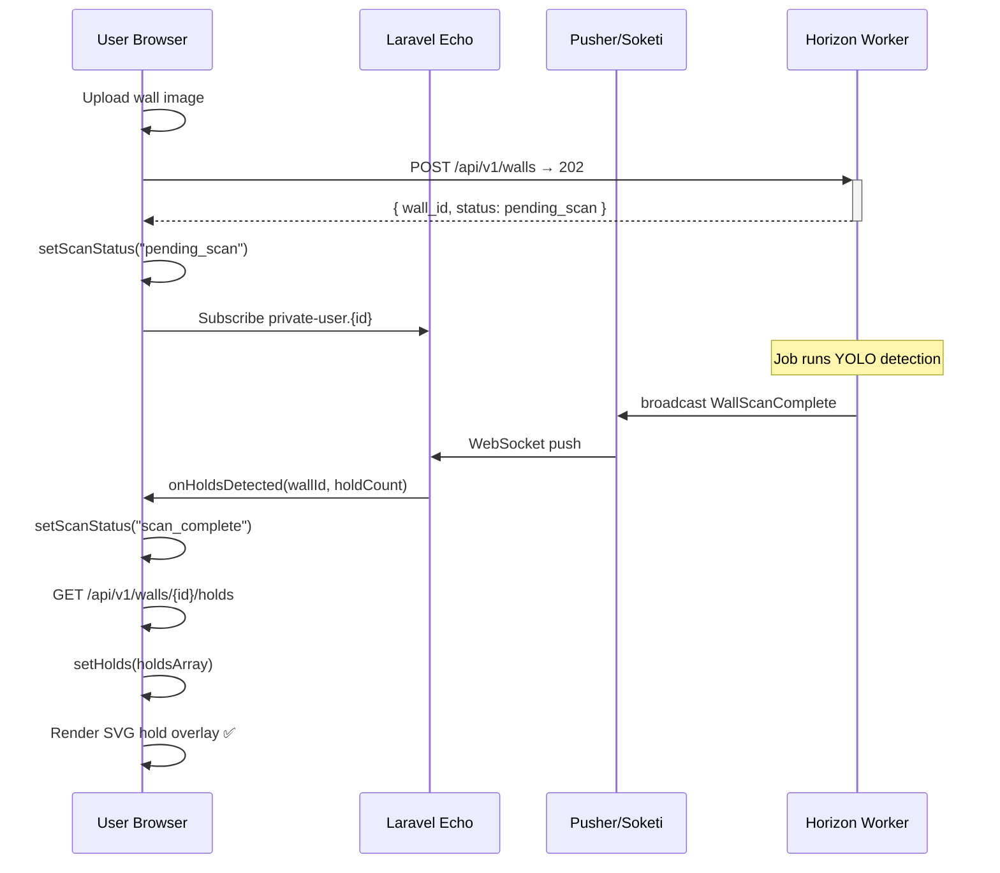

# FRONTEND.md — Frontend Architecture & Component Guide

> **Version:** 1.0.0 | **Stack:** React 18 + Zustand + Laravel Echo + Vite

---

## Component Interaction Diagram

```mermaid
flowchart TD
    subgraph Page["📄 WallDetail Page"]
        WD[WallDetail.jsx\nLifecycle + WebSocket orchestration]
    end

    subgraph State["🏪 Zustand Store — useWallStore"]
        WS[(wall · holds · scanStatus\nexcludedHolds · routeHoldMap\ncurrentRoute · notifications)]
    end

    subgraph Components["🧩 Components"]
        WU[WallUploader\nDrag-drop upload\nXHR progress]
        HMO[HoldMapOverlay\nSVG bounding boxes\nClick-to-exclude]
        RGP[RouteGeneratorPanel\nGrade · Style · Body type\nHold count]
        SRM[SaveRouteModal\nName · Publish toggle\nShare URL copy]
        TC[ToastContainer\nSuccess · Error\nAuto-dismiss]
    end

    subgraph Hooks["🪝 Hooks"]
        UE[useEcho\nLaravel Echo\nWebSocket listener]
        API[api.js\nXHR/fetch client\nBearerToken]
    end

    subgraph Backend["🟥 Laravel API"]
        LAPI[/api/v1/walls\n/api/v1/holds\n/api/v1/routes]
        WS_SRV[Pusher/Soketi\nWallScanComplete\nWallScanFailed]
    end

    %% Page ↔ Store
    WD -- setWall · setHolds\nscanStatus polling --> WS
    WS -- wall · holds · currentRoute --> WD

    %% Page ↔ Hooks
    WD -- userId · wallId --> UE
    UE -- onHoldsDetected\nonScanFailed --> WD

    %% Echo ↔ WS Server
    UE <-->|WebSocket| WS_SRV

    %% Components ↔ Store
    WU -- setWall\nsetUploadProgress --> WS
    HMO -- reads holds\nexcludedHolds\nrouteHoldMap --> WS
    HMO -- toggleHoldExclusion --> WS
    RGP -- reads holds · grade\nsetCurrentRoute\nsetGenerating --> WS
    SRM -- reads currentRoute\nsetCurrentRoute\ncloseSaveModal --> WS
    TC -- reads notifications\nremoveNotification --> WS

    %% Components ↔ API
    WU -- POST /walls --> API
    RGP -- POST /routes/generate --> API
    SRM -- PATCH /routes/:id --> API

    %% API ↔ Laravel
    API <-->|HTTP JSON| LAPI

    style State fill:#1E293B,color:#F1F5F9,stroke:#334155
    style Components fill:#0F172A,color:#F1F5F9,stroke:#334155
    style Backend fill:#7C2020,color:#FEF2F2,stroke:#991B1B
    style Hooks fill:#0D2040,color:#F1F5F9,stroke:#1E3A5F
```

---

## Component Reference

### WallUploader

| File | `components/WallUploader/index.jsx` |
|------|-------------------------------------|
| **Props** | `onSuccess(wall): void` |
| **State** | `isDragging, preview, file, isUploading, form, uploadProgress` |
| **Key features** | Drag-and-drop, click-to-browse, XHR progress tracking, image preview, metadata form |
| **ARIA** | `role="button"` on drop zone, `role="progressbar"` on progress, `aria-invalid` on errors |

```
[Drop zone] → file selected → [Preview + form] → submit → XHR upload
                                                           ↓
                                              POST /api/v1/walls (multipart)
                                                           ↓
                                              202 Accepted → dispatch job → WebSocket
```

---

### HoldMapOverlay

| File | `components/HoldMapOverlay/index.jsx` |
|------|---------------------------------------|
| **Props** | `imageUrl: string, wallName: string` |
| **Reads from store** | `holds, scanStatus, excludedHolds, routeHoldMap, currentRoute` |
| **Writes to store** | `toggleHoldExclusion(holdId)` |
| **Key features** | SVG `viewBox="0 0 1 1"` overlay, hold ellipses, scan sweep animation, role-coloured holds, hover tooltip, keyboard navigation |

**Hold rendering logic:**
```
hold → getHoldDisplayProps(id)
  ├── excluded?       → grey, semi-transparent, ✕ mark
  ├── in current route? → ROLE colour (green/blue/yellow/red)
  └── default          → white semi-transparent
```

**Coordinate system:** All `x, y, width, height` values are normalised [0–1]. The SVG uses `viewBox="0 0 1 1" preserveAspectRatio="none"` so it stretches to pixel-perfectly cover the image at any resolution.

---

### RouteGeneratorPanel

| File | `components/RouteGeneratorPanel/index.jsx` |
|------|---------------------------------------------|
| **Props** | `wallId: string, onRouteGenerated?: fn` |
| **Reads from store** | `holds, excludedHolds, isGenerating, currentRoute` |
| **Writes to store** | `setCurrentRoute, setGenerating, clearRoute, openSaveModal` |
| **Key features** | V-scale grade slider, style icon grid, body type selector, auto/manual hold count, route quality bar, role breakdown chips |

**Grade slider** uses a CSS gradient track from green (V0) to red (V16). The label colour changes via `hsl(140 - pct*140)` for a smooth visual mapping.

---

### SaveRouteModal

| File | `components/SaveRouteModal/index.jsx` |
|------|---------------------------------------|
| **Props** | _(none — reads from store)_ |
| **Reads from store** | `isSaveModalOpen, currentRoute` |
| **Writes to store** | `closeSaveModal, setCurrentRoute` |
| **Key features** | Focus trap, Escape key close, custom publish toggle, share URL with clipboard copy, animated success state |
| **ARIA** | `role="dialog" aria-modal="true"`, `aria-labelledby`, focus trap via `onKeyDown` |

---

### ToastContainer

| File | `components/Toast/index.jsx` |
|------|------------------------------|
| **Props** | _(none — reads from store)_ |
| **Reads from store** | `notifications` |
| **Writes to store** | `removeNotification(id)` |
| **Key features** | Stacked bottom-right notifications, auto-dismiss after 5s, progress bar countdown, type-specific left border colour |
| **ARIA** | `aria-live="polite"` (success/info/warning), `aria-live="assertive"` (error) |

---

## Responsive Breakpoints

| Breakpoint | Layout |
|------------|--------|
| ≥ 900px | Two-column: Hold map (flex:1) + Sidebar panel (300px fixed) |
| < 900px | Single column: Hold map full-width, panel below |
| < 600px | Compact: Navbar simplified, toast full-width |

---

## State Management — Zustand Store Shape

```javascript
{
  // Entity state
  wall:           Wall | null,
  scanStatus:     'idle' | 'uploading' | 'pending_scan' | 'scanning' | 'scan_complete' | 'scan_failed',
  holds:          Hold[],
  excludedHolds:  Set<string>,        // hold IDs excluded by user
  currentRoute:   Route | null,
  routeHoldMap:   { [holdId]: { role, position_order } },

  // UI state
  uploadProgress:   number,           // 0–100
  isGenerating:     boolean,
  isSaveModalOpen:  boolean,
  notifications:    { id, type, message }[],

  // Actions
  setWall, setScanStatus, setHolds,
  toggleHoldExclusion, setCurrentRoute, clearRoute,
  setGenerating, openSaveModal, closeSaveModal,
  addNotification, removeNotification,

  // Computed helper (non-reactive)
  getHoldDisplayProps(holdId) → { fill, stroke, isExcluded?, isInRoute?, role? }
}
```

---

## Real-Time Flow



---

## Setup & Run

```bash
# Install dependencies
npm install

# Development (with HMR)
npm run dev

# Production build
npm run build
```

**Required `.env` variables for the frontend:**

```ini
VITE_API_URL=http://localhost:8000/api/v1
VITE_PUSHER_APP_KEY=your_pusher_key
VITE_PUSHER_APP_CLUSTER=mt1
VITE_PUSHER_HOST=           # Leave blank for Pusher cloud
VITE_PUSHER_PORT=443
VITE_PUSHER_SCHEME=https
```
