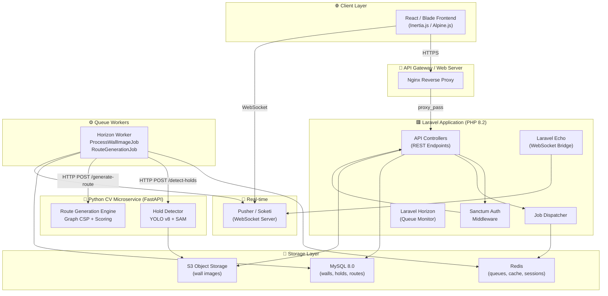
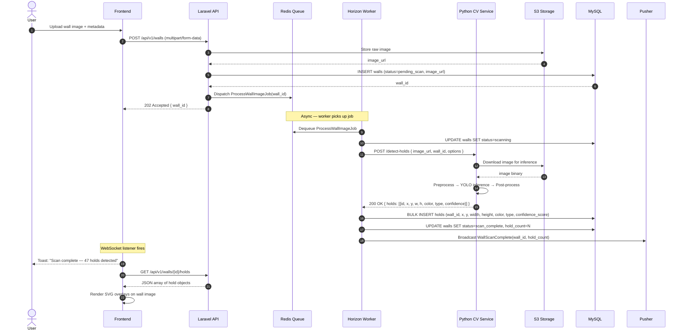
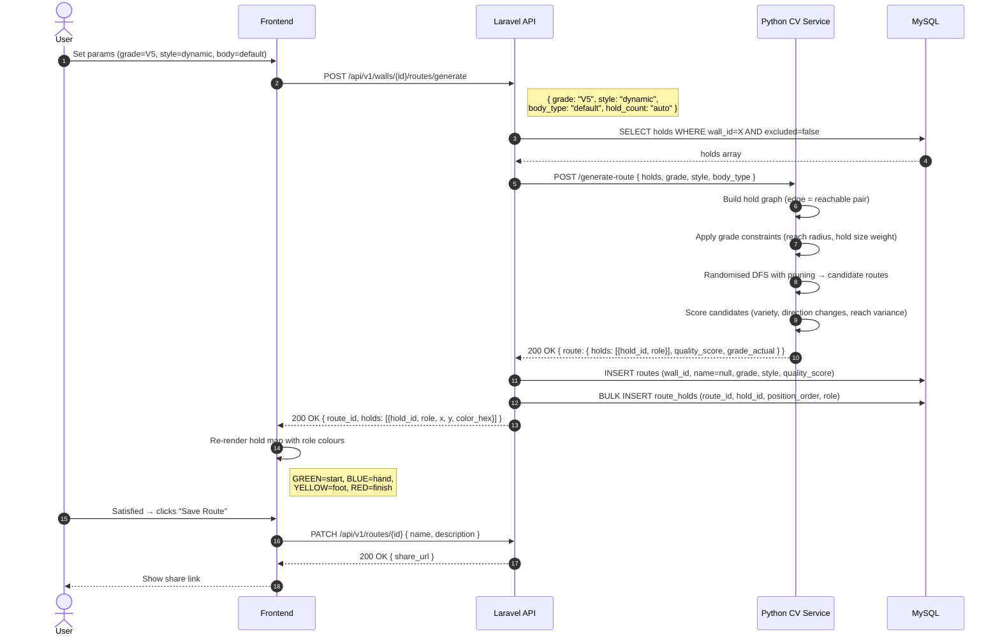
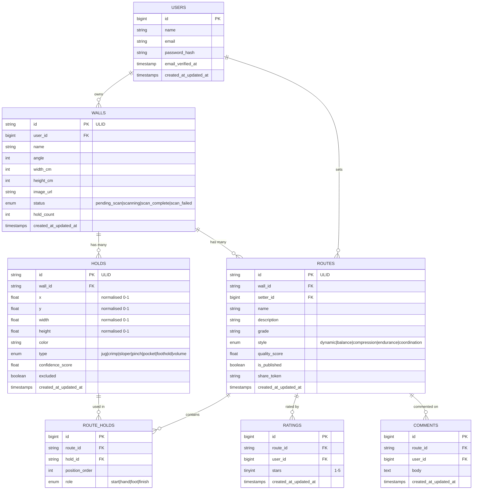

# WORKFLOW.md — Climbing Spray Wall App
> **Version:** 1.0.0 | **Last Updated:** 2026-07-29 | **Status:** Living Document

---

## Table of Contents

1. [Project Overview](#1-project-overview)
2. [End-to-End User Workflow](#2-end-to-end-user-workflow)
3. [System Architecture](#3-system-architecture)
4. [Service Responsibilities](#4-service-responsibilities)
5. [Data Flow — Hold Detection](#5-data-flow--hold-detection)
6. [Data Flow — Route Generation](#6-data-flow--route-generation)
7. [API Contract Reference](#7-api-contract-reference)
8. [Database Schema Overview](#8-database-schema-overview)
9. [Real-Time Communication](#9-real-time-communication)
10. [Failure Handling & Edge Cases](#10-failure-handling--edge-cases)
11. [Glossary](#11-glossary)

---

## 1. Project Overview

The **Climbing Spray Wall App** is a web-based platform that enables climbers to digitise their physical spray wall by uploading a photograph. The system automatically detects all climbing holds using a computer vision (CV) pipeline, stores their positions and properties, and then uses an AI-driven route generation engine to create traversable climbing routes based on user-defined parameters.

### Core Value Pillars

| Pillar | Description |
|--------|-------------|
| **Detect** | Scan a spray wall image and extract all holds automatically |
| **Map** | Display an interactive, annotated hold map overlaid on the wall image |
| **Generate** | Create AI-curated routes from the hold set |
| **Share** | Save, name, rate, and share routes with other climbers |

### Technology Stack

| Layer | Technology |
|-------|------------|
| Backend API | Laravel 11 (PHP 8.2+) |
| CV Microservice | Python 3.11 + FastAPI + YOLO v8 / SAM |
| Frontend | React 18 + Inertia.js (or Blade + Alpine.js) |
| Queue System | Laravel Horizon + Redis |
| Database | MySQL 8.0 |
| File Storage | AWS S3 / S3-compatible (MinIO for local) |
| Real-time | Laravel Echo + Pusher (or Soketi self-hosted) |
| Auth | Laravel Sanctum (SPA token auth) |

---

## 2. End-to-End User Workflow

The following numbered steps describe the complete user journey from registration to sharing a route.

### Phase A — Onboarding

```
1. User registers an account (name, email, password)
2. User logs in and receives a Sanctum auth token
3. User lands on the Dashboard (empty state, prompted to upload a wall)
```

### Phase B — Wall Setup

```
4.  User navigates to "My Walls" → clicks "Add New Wall"
5.  User provides wall metadata:
      - Wall name (e.g., "Garage Board 40°")
      - Wall angle (0°–70°, used in route grading calculations)
      - Panel dimensions (width × height in cm, for real-world hold positioning)
6.  User uploads a photograph of the spray wall
      - Accepted formats: JPEG, PNG, HEIC
      - Max file size: 20 MB
      - Min resolution: 1000 × 1000 px
7.  Laravel validates and stores the image to S3
8.  Laravel creates a `walls` record (status: "pending_scan")
9.  Laravel dispatches ProcessWallImageJob to the Redis queue
10. User sees a loading state: "Scanning your wall for holds…"
```

### Phase C — Hold Detection (Automated, Background)

```
11. Laravel Horizon worker picks up ProcessWallImageJob
12. HoldDetectionService calls the Python CV microservice (POST /detect-holds)
13. CV microservice analyses the image:
      a. Preprocesses image (resize, normalise, enhance contrast)
      b. Runs YOLO v8 inference for hold bounding boxes
      c. Applies SAM for precise hold segmentation (optional high-accuracy mode)
      d. Post-processes results (de-duplication, colour classification, size estimation)
14. CV microservice returns a JSON array of detected holds
15. HoldDetectionService persists each hold to the `holds` table
16. Wall status updated to "scan_complete"
17. WebSocket event fired → frontend notified
18. User receives a toast notification: "Wall scan complete — X holds detected"
```

### Phase D — Interactive Hold Map

```
19. Frontend loads the wall detail page
20. The wall image is displayed; SVG bounding-box overlays render on each hold
21. User can:
      - Click any hold to view its details (colour, type, size, coordinates)
      - Toggle holds between Active / Excluded from route generation
      - Manually adjust a bounding box if detection was slightly off
      - Add holds manually (fallback for missed detections)
22. Hold map state is auto-saved to the backend
```

### Phase E — Route Generation

```
23. User opens the "Generate Route" panel (sidebar/modal)
24. User sets generation parameters:
      - Difficulty: V0–V16 (Hueco / V-scale)
      - Style: Dynamic | Balance | Compression | Endurance | Coordination
      - Body type: Default | Tall | Short (adjusts reach radius)
      - Hold count: 4–20 holds (auto-set by difficulty if left on "auto")
25. User clicks "Generate"
26. Frontend calls POST /api/v1/walls/{id}/routes/generate
27. Laravel RouteGenerationService calls the Python route engine (POST /generate-route)
28. Route engine:
      a. Builds a hold graph (nodes = holds, edges = reachable pairs given body type)
      b. Applies difficulty constraints (reach distance range, hold size weighting)
      c. Runs randomised DFS with constraint pruning to find valid hold sequences
      d. Scores and ranks candidate routes
      e. Returns the top-ranked route as an ordered list of hold IDs with roles
29. Laravel stores the route in the `routes` table and creates `route_holds` pivot records
30. Frontend renders the route:
      - GREEN: Start holds (bottom)
      - BLUE: Hand holds (intermediate)
      - YELLOW: Foot holds
      - RED: Finish hold (top)
31. User can regenerate to get alternative routes
```

### Phase F — Save, Rate & Share

```
32. User names the route (e.g., "Tuesday Crusher V6")
33. User optionally adds a description, assigns a sector tag, and saves
34. A unique shareable URL is generated (e.g., /routes/abc123xyz)
35. Shared routes are publicly accessible without authentication (read-only)
36. Other users can rate routes (1–5 stars) and leave comments
37. Route setter can publish/unpublish routes
```

---

## 3. System Architecture



---

## 4. Service Responsibilities

### 4.1 Laravel Application

| Responsibility | Details |
|----------------|---------|
| Authentication | Registration, login, logout, token management via Sanctum |
| Wall Management | CRUD operations for walls, image upload to S3 |
| Job Orchestration | Dispatch and monitor async CV and route jobs |
| Data Persistence | Persist holds, routes, ratings, comments |
| API Gateway | Expose RESTful JSON API for all client interactions |
| Real-time Events | Broadcast status events via Pusher/Soketi |

### 4.2 Python CV Microservice

| Responsibility | Details |
|----------------|---------|
| Hold Detection | YOLO v8 inference on wall images |
| Hold Segmentation | SAM-based precise boundary extraction (optional) |
| Colour Classification | HSV analysis to assign colour category per hold |
| Route Generation | Graph-based CSP route selection algorithm |
| Health & Metrics | `/health` and `/metrics` endpoints for observability |

### 4.3 Frontend (React + Inertia)

| Responsibility | Details |
|----------------|---------|
| Wall Upload UI | Drag-and-drop uploader with progress and preview |
| Hold Map | SVG overlay on wall image for interactive hold display |
| Route Visualiser | Colour-coded hold highlighting for route display |
| Route Generator Panel | Parameter controls (difficulty, style, body type) |
| Real-time Updates | WebSocket listener for scan/generation completion events |
| Share & Rate | Public route pages, star ratings, comments |

---

## 5. Data Flow — Hold Detection



---

## 6. Data Flow — Route Generation



---

## 7. API Contract Reference

> **Base URL:** `https://api.spraywall.app/api/v1`  
> **Auth:** `Authorization: Bearer {token}` (all protected routes)  
> **Content-Type:** `application/json` unless noted

---

### 7.1 Authentication

#### `POST /auth/register`

**Request:**
```json
{
  "name": "Alex Honnold",
  "email": "alex@example.com",
  "password": "super_secret_123",
  "password_confirmation": "super_secret_123"
}
```
**Response `201`:**
```json
{
  "user": { "id": 1, "name": "Alex Honnold", "email": "alex@example.com" },
  "token": "1|abc123xyz..."
}
```

#### `POST /auth/login`

**Request:**
```json
{ "email": "alex@example.com", "password": "super_secret_123" }
```
**Response `200`:**
```json
{ "token": "1|abc123xyz..." }
```

---

### 7.2 Walls

#### `POST /walls` *(multipart/form-data)*

| Field | Type | Required | Notes |
|-------|------|----------|-------|
| `name` | string | ✅ | Max 100 chars |
| `angle` | integer | ✅ | 0–70 (degrees) |
| `width_cm` | integer | ✅ | Panel width in cm |
| `height_cm` | integer | ✅ | Panel height in cm |
| `image` | file | ✅ | JPEG/PNG/HEIC ≤ 20 MB |

**Response `202`:**
```json
{
  "data": {
    "id": "wall_01HZ...",
    "name": "Garage Board 40°",
    "status": "pending_scan",
    "image_url": "https://s3.../walls/wall_01HZ.jpg",
    "created_at": "2026-07-29T14:00:00Z"
  }
}
```

#### `GET /walls/{id}`

**Response `200`:**
```json
{
  "data": {
    "id": "wall_01HZ...",
    "name": "Garage Board 40°",
    "angle": 40,
    "width_cm": 244,
    "height_cm": 244,
    "status": "scan_complete",
    "hold_count": 47,
    "image_url": "https://s3.../walls/wall_01HZ.jpg",
    "created_at": "2026-07-29T14:00:00Z"
  }
}
```

**Wall Status Values:**

| Status | Meaning |
|--------|---------|
| `pending_scan` | Image uploaded, awaiting CV processing |
| `scanning` | CV microservice is actively processing |
| `scan_complete` | Holds successfully detected and stored |
| `scan_failed` | CV processing encountered an unrecoverable error |

---

### 7.3 Holds

#### `GET /walls/{id}/holds`

**Response `200`:**
```json
{
  "data": [
    {
      "id": "hold_001",
      "wall_id": "wall_01HZ...",
      "x": 0.312,
      "y": 0.748,
      "width": 0.041,
      "height": 0.038,
      "color": "blue",
      "type": "crimp",
      "confidence_score": 0.94,
      "excluded": false
    }
  ],
  "meta": { "total": 47 }
}
```

> **Coordinate System:** `x`, `y`, `width`, `height` are normalised (0.0–1.0) relative to image dimensions. Convert to pixels by multiplying by the displayed image width/height.

#### `PATCH /holds/{id}`

Update hold properties or exclude from route generation.

**Request:**
```json
{ "excluded": true, "type": "foothold" }
```

---

### 7.4 Route Generation

#### `POST /walls/{id}/routes/generate`

**Request:**
```json
{
  "grade": "V5",
  "style": "dynamic",
  "body_type": "default",
  "hold_count": "auto"
}
```

**Grade Options:** `"V0"` – `"V16"` or `"auto"`  
**Style Options:** `"dynamic"` | `"balance"` | `"compression"` | `"endurance"` | `"coordination"`  
**Body Type Options:** `"default"` | `"tall"` | `"short"`  
**Hold Count:** `4`–`20` or `"auto"`

**Response `200`:**
```json
{
  "data": {
    "id": "route_abc123",
    "wall_id": "wall_01HZ...",
    "grade": "V5",
    "style": "dynamic",
    "quality_score": 0.87,
    "status": "unsaved",
    "holds": [
      { "hold_id": "hold_012", "role": "start",  "position_order": 1 },
      { "hold_id": "hold_023", "role": "hand",   "position_order": 2 },
      { "hold_id": "hold_031", "role": "foot",   "position_order": 3 },
      { "hold_id": "hold_045", "role": "finish", "position_order": 4 }
    ]
  }
}
```

#### `PATCH /routes/{id}` — Save a Route

**Request:**
```json
{
  "name": "Tuesday Crusher",
  "description": "Powerful V5 with a big move off the crimp at the lip",
  "is_published": true
}
```
**Response `200`:**
```json
{
  "data": {
    "id": "route_abc123",
    "name": "Tuesday Crusher",
    "share_url": "https://spraywall.app/routes/abc123"
  }
}
```

---

### 7.5 Ratings & Comments

#### `POST /routes/{id}/ratings`
```json
{ "stars": 4 }
```
**Response `201`:** `{ "average_rating": 4.2, "total_ratings": 11 }`

#### `POST /routes/{id}/comments`
```json
{ "body": "Felt more like V6 to me. That sloper is brutal!" }
```

---

## 8. Database Schema Overview



---

## 9. Real-Time Communication

The app uses **Laravel Echo + Pusher/Soketi** for WebSocket-based real-time events.

### Event Channels

| Channel | Type | Triggered By |
|---------|------|-------------|
| `private-user.{user_id}` | Private | Horizon Worker |
| `public-routes.{route_id}` | Public | Route ratings/comments |

### Event Payloads

#### `WallScanComplete`
```json
{
  "event": "WallScanComplete",
  "data": {
    "wall_id": "wall_01HZ...",
    "hold_count": 47,
    "status": "scan_complete"
  }
}
```

#### `WallScanFailed`
```json
{
  "event": "WallScanFailed",
  "data": {
    "wall_id": "wall_01HZ...",
    "reason": "no_holds_detected",
    "message": "No climbing holds could be identified. Please re-upload a clearer image."
  }
}
```

#### `RouteGenerated`
```json
{
  "event": "RouteGenerated",
  "data": {
    "route_id": "route_abc123",
    "grade": "V5",
    "quality_score": 0.87
  }
}
```

---

## 10. Failure Handling & Edge Cases

### 10.1 Image Upload Failures

| Scenario | HTTP Status | Error Code | User Message |
|----------|-------------|------------|--------------|
| File exceeds 20 MB | `422` | `IMAGE_TOO_LARGE` | "Image must be under 20 MB." |
| Unsupported format | `422` | `IMAGE_FORMAT_INVALID` | "Please upload a JPEG, PNG, or HEIC file." |
| Resolution too low | `422` | `IMAGE_RESOLUTION_LOW` | "Image must be at least 1000×1000 pixels." |
| S3 storage failure | `503` | `STORAGE_UNAVAILABLE` | "Storage service is temporarily unavailable. Please try again." |

### 10.2 Hold Detection Failures

| Scenario | Wall Status | Action |
|----------|-------------|--------|
| CV service unreachable | `scan_failed` | Retry job up to 3× with exponential backoff; alert admin after 3rd failure |
| CV service timeout (> 120s) | `scan_failed` | Mark failed, broadcast `WallScanFailed`, prompt user to retry |
| No holds detected | `scan_failed` | Broadcast `WallScanFailed` with `reason: no_holds_detected`; suggest re-taking photo |
| Fewer than 4 holds detected | `scan_complete` | Store holds, but warn user route generation requires ≥ 4 holds |
| Low confidence detections | `scan_complete` | Flag holds with `confidence_score < 0.5` as "unverified"; user must confirm |

### 10.3 Route Generation Failures

| Scenario | HTTP Status | Error Code | Resolution |
|----------|-------------|------------|------------|
| Insufficient holds (< 4 active) | `422` | `INSUFFICIENT_HOLDS` | Prompt user to un-exclude holds or lower hold count |
| No valid route found for grade | `422` | `NO_VALID_ROUTE` | Suggest a lower grade or different style |
| CV route service timeout | `503` | `GENERATION_TIMEOUT` | Retry once; if fails, return error with retry prompt |
| Impossible grade for wall | `422` | `GRADE_NOT_ACHIEVABLE` | Return achievable grade range for the detected hold set |

### 10.4 General Error Response Shape

All errors follow a consistent envelope:
```json
{
  "error": {
    "code": "IMAGE_TOO_LARGE",
    "message": "Image must be under 20 MB.",
    "details": {}
  }
}
```

### 10.5 Job Retry Policy

```
ProcessWallImageJob:
  - tries: 3
  - backoff: [30s, 120s, 300s] (exponential)
  - timeout: 120s per attempt
  - onFailed: UpdateWallStatusFailed + BroadcastWallScanFailed + NotifyAdmin

RouteGenerationJob (if async):
  - tries: 2
  - backoff: [15s, 60s]
  - timeout: 60s per attempt
```

---

## 11. Glossary

| Term | Definition |
|------|------------|
| **Spray Wall** | A climbing training board where holds can be placed freely in any position, allowing for custom route creation. Unlike kilter boards or moon boards, spray walls have no fixed layout. |
| **Hold** | A shaped resin or polyurethane piece screwed onto the climbing board that a climber grabs or steps on. |
| **Hold Types** | **Jug** – large, easy to grip; **Crimp** – small edge; **Sloper** – rounded, friction-dependent; **Pinch** – squeezed from sides; **Pocket** – hole for 1–3 fingers; **Volume** – large geometric shape that changes the wall angle locally. |
| **Route** | A defined sequence of holds that a climber ascends from a start hold to a finish hold. |
| **Route Setter** | The person who designs a route by selecting which holds to use and their roles. |
| **Grade** | A standardised difficulty rating. This app uses the **Hueco/V-Scale** (V0 beginner → V16 world-class). |
| **V-Scale** | The most common bouldering grade system in North America and used globally. V0 is beginner level; V16 is the hardest grade ever achieved. |
| **Start Hold** | The hold(s) from which a climber begins a route with both hands statically placed. Typically located low on the wall. |
| **Finish Hold** | The final hold of a route. A climber must control it (match both hands or reach above) to complete the route. |
| **Foot Hold** | A hold designated for the feet only. Helps define balance-oriented routes. |
| **Role** | The designation of a hold within a route: `start`, `hand`, `foot`, or `finish`. |
| **Style** | A characterisation of a route's movement demands: **Dynamic** (large moves), **Balance** (precise footwork), **Compression** (body tension), **Endurance** (many holds, sustained effort), **Coordination** (timing-dependent moves). |
| **Bounding Box** | A rectangle described by (x, y, width, height) that encloses a detected hold in the image. Coordinates are normalised (0.0–1.0). |
| **YOLO** | "You Only Look Once" — a real-time object detection neural network used to locate holds in wall images. |
| **SAM** | "Segment Anything Model" by Meta — used for precise pixel-level segmentation of detected holds (optional high-accuracy mode). |
| **CSP** | Constraint Satisfaction Problem — the mathematical framework used to model route generation given hold position constraints and difficulty parameters. |
| **Horizon** | Laravel Horizon is a dashboard and supervisor for Laravel's Redis-based queue workers. Used to monitor `ProcessWallImageJob` and `RouteGenerationJob`. |
| **Soketi** | An open-source, self-hosted WebSocket server compatible with the Pusher protocol. Used as a drop-in replacement for Pusher in self-hosted deployments. |
| **ULID** | Universally Unique Lexicographically Sortable Identifier — used as primary keys for walls, holds, and routes instead of sequential integers for better security and distributed-system compatibility. |
| **Wall Angle** | The overhang angle of the spray wall measured from vertical. A 0° wall is perfectly vertical; a 45° wall leans significantly over the climber, making routes harder. |

---

*This document is maintained by the core engineering team. All changes must be reviewed via pull request.*
