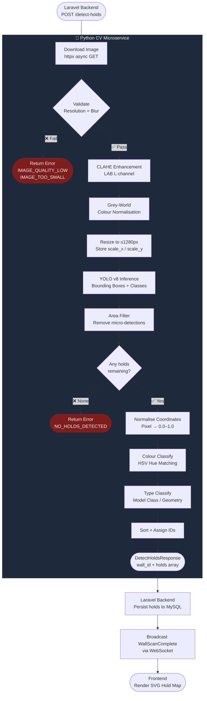

# CV_PIPELINE.md — Hold Detection Pipeline: Design & Rationale

> **Scope:** Computer Vision Microservice (`cv-service/`)  
> **Version:** 1.0.0 | **Last Updated:** 2026-07-29

---

## Table of Contents
1. [Pipeline Overview](#1-pipeline-overview)
2. [Model Selection Rationale](#2-model-selection-rationale)
3. [Training Data Strategy](#3-training-data-strategy)
4. [Step-by-Step Pipeline](#4-step-by-step-pipeline)
5. [Pipeline Diagram](#5-pipeline-diagram)
6. [Response Schema](#6-response-schema)
7. [Error Handling](#7-error-handling)
8. [Performance Benchmarks & Targets](#8-performance-benchmarks--targets)
9. [Extension Roadmap](#9-extension-roadmap)

---

## 1. Pipeline Overview

The hold detection pipeline converts a raw spray wall photograph into a structured list of detected holds — each with a normalised bounding box, colour label, hold type, and confidence score.

```
Image URL
    │
    ▼
[ Download + Decode ]  ──── httpx async GET from S3
    │
    ▼
[ Validate ]           ──── Resolution ≥ 640px², Laplacian blur check
    │
    ▼
[ CLAHE Enhancement ]  ──── Equalise contrast per 8×8 tile (LAB space)
    │
    ▼
[ Grey-World Normalise ]─── Reduce background colour bias
    │
    ▼
[ Resize for Inference ]─── Longest edge → 1280px (maintains aspect ratio)
    │
    ▼
[ YOLO v8 Inference ]   ──── Multi-class or single-class object detection
    │
    ▼
[ NMS (built-in) ]      ──── IoU-threshold duplicate suppression
    │
    ▼
[ Area Filter ]         ──── Remove detections < 0.05% of image area
    │
    ▼
[ Coordinate Normalise ]─── Pixel → [0.0, 1.0] in original image space
    │
    ▼
[ Colour Classify ]     ──── HSV hue-range matching per cropped hold region
    │
    ▼
[ Type Classify ]       ──── Model class (Tier 1) or geometry heuristic (Tier 2)
    │
    ▼
[ Sort + ID Assignment ]─── Top-left → bottom-right, deterministic IDs
    │
    ▼
DetectHoldsResponse JSON
```

---

## 2. Model Selection Rationale

### 2.1 Candidate Models Evaluated

| Model | Approach | Pros | Cons | Verdict |
|-------|----------|------|------|---------|
| **YOLO v8 (chosen)** | Anchor-free one-stage detection | Fast inference (< 50ms on GPU), well-maintained, easy fine-tuning, excellent at overlapping objects | Bounding boxes only (no pixel masks) | ✅ **Primary model** |
| SAM (Segment Anything) | Promptable segmentation | Pixel-perfect hold boundaries, great for oddly-shaped holds | Requires prompt points (needs pre-detection), 400ms+ per image on CPU | ✅ **Optional accurate mode** |
| Custom CNN (ResNet + RPN) | Fully custom Faster R-CNN | Maximum control | Requires significant labelled data, high training effort, slower iteration | ❌ Deferred to v2 |
| Colour-based segmentation | OpenCV HSV + contour detection | No training data needed | Fails on neutral-coloured holds, background interference | ❌ Used only as fallback |

### 2.2 Why YOLO v8 is the Right Choice for MVP

1. **Speed:** YOLOv8-Medium runs at ~35ms/image on a T4 GPU and ~800ms on CPU. This fits within the 120-second job timeout even on CPU-only instances during MVP.

2. **Fine-tuning simplicity:** Ultralytics provides a one-command fine-tuning API (`model.train(data=..., epochs=...)`). Getting from pre-trained to hold-specific in under 50 images per class is achievable with transfer learning.

3. **Active ecosystem:** The Ultralytics YOLO v8 library is actively maintained, has thorough documentation, and supports export to ONNX for later optimisation.

4. **Multi-class ready:** A single YOLO v8 model can simultaneously detect *and classify* hold types (jug, crimp, sloper…) if trained with per-type labels — eliminating the need for a separate classification head.

### 2.3 YOLO v8 Model Size Trade-offs

| Variant | Params | mAP (COCO) | GPU Latency | CPU Latency | Recommendation |
|---------|--------|------------|-------------|-------------|----------------|
| YOLOv8n (nano) | 3.2M | 37.3 | ~2ms | ~80ms | Dev/testing |
| YOLOv8s (small) | 11.2M | 44.9 | ~4ms | ~200ms | Staging |
| **YOLOv8m (medium)** | **25.9M** | **50.2** | **~9ms** | **~500ms** | **Production** ✅ |
| YOLOv8l (large) | 43.7M | 52.9 | ~14ms | ~1200ms | If GPU available |

### 2.4 SAM — Accurate Mode

When `mode=accurate`, after YOLO identifies bounding boxes, SAM is prompted with the box coordinates to produce pixel-level segmentation masks. This provides:
- Precise hold boundaries for better colour classification (reduces background bleed)
- Exact hold area for difficulty scoring (hold area correlates to difficulty)
- Better visual overlays on the frontend

SAM is loaded lazily on first accurate-mode request and cached.

---

## 3. Training Data Strategy

### 3.1 Challenge

There is **no public dataset** of labelled spray wall hold images. We must build one from scratch.

### 3.2 Data Collection Phases

#### Phase 1: Bootstrap (Weeks 1–4) — Pseudo-labels + Colour Segmentation
- Collect 200–500 spray wall images from:
  - Public climbing gym Instagram accounts (with permission)
  - MoonBoard / Kilter Board app screenshots (known hold positions)
  - The project's own beta users
- Apply colour-based OpenCV segmentation to auto-label hold positions (noisy but free)
- Manually verify and correct labels using [Label Studio](https://labelstud.io/) or [Roboflow](https://roboflow.com/)

#### Phase 2: Active Learning (Weeks 5–8)
- Train YOLO v8n on Phase 1 data
- Run inference on unlabelled images
- Surface low-confidence predictions (< 0.6) for human review
- Use the model's own uncertainty to prioritise labelling effort

#### Phase 3: Community Contribution (Post-launch)
- Build a label-correction UI in the app: "Was this hold detected correctly?"
- Correct/missed holds flagged by users feed directly into the re-training pipeline
- Flywheel: more users → more corrections → better model → better detections

### 3.3 Label Schema (YOLO format)

```
# Each line in a .txt annotation file:
# <class_id> <center_x> <center_y> <width> <height>
# All values normalised [0.0, 1.0]

0  0.312  0.748  0.041  0.038   # jug
1  0.512  0.430  0.022  0.018   # crimp
2  0.701  0.210  0.055  0.047   # sloper
```

**Class IDs:**

| ID | Type | Approx count target |
|----|------|---------------------|
| 0 | jug | 500 instances |
| 1 | crimp | 800 instances |
| 2 | sloper | 300 instances |
| 3 | pinch | 300 instances |
| 4 | pocket | 200 instances |
| 5 | foothold | 400 instances |
| 6 | volume | 150 instances |

### 3.4 Data Augmentation

Applied during training to improve robustness to real-world variation:

| Augmentation | Range | Purpose |
|-------------|-------|---------|
| Mosaic | 4-image mosaic | Improves small object detection |
| HSV shift (H) | ±0.015 | Hold colour invariance |
| HSV shift (S) | ±0.7 | Lighting variation |
| HSV shift (V) | ±0.4 | Lighting variation |
| Horizontal flip | 0.5 probability | Left/right symmetry |
| Rotation | ±5° | Slight camera tilt |
| Scale | 0.5–1.5× | Distance variation |
| Blur | kernel 0–3px | Out-of-focus cameras |

---

## 4. Step-by-Step Pipeline

### Step 1 — Image Download
**Module:** `preprocessor.py → download_image()`  
**Method:** `async httpx.AsyncClient GET` from a pre-signed S3 URL  
**Timeout:** 30 seconds  
**Output:** Raw BGR numpy array

### Step 2 — Validation
**Module:** `preprocessor.py → validate_image()`

| Check | Method | Threshold | Error |
|-------|--------|-----------|-------|
| Minimum resolution | `image.shape` | 640×640px | `IMAGE_TOO_SMALL` |
| Blur detection | Laplacian variance | < 50.0 | `IMAGE_QUALITY_LOW` |

### Step 3 — CLAHE Contrast Enhancement
**Module:** `preprocessor.py → apply_clahe()`  
**Why:** Spray walls are often photographed in garages with a single overhead light, creating hotspots and deep shadows. CLAHE equalises local contrast without affecting colour accuracy (applied on L-channel of LAB).  
**Settings:** clipLimit=2.0, tileGridSize=(8,8)

### Step 4 — Grey-World Colour Normalisation
**Module:** `preprocessor.py → remove_background_bias()`  
**Why:** Walls painted with a strong background colour (blue, green) shift the entire image's colour distribution, confusing HSV-based colour classifiers.  
**Method:** Per-channel mean subtraction scaled to neutral grey.

### Step 5 — Resize for Inference
**Module:** `preprocessor.py → resize_for_inference()`  
**Why:** YOLO is most accurate near its training resolution. Passing a 4000×4000px image wastes compute and doesn't improve accuracy.  
**Max dimension:** 1280px (longest edge), aspect ratio preserved.  
**Scale factors** (`scale_x`, `scale_y`) are stored and used in Step 8 to map detections back.

### Step 6 — YOLO Inference
**Module:** `hold_detector.py → _run_yolo()`  
**Input:** 1280px BGR image  
**Output:** List of raw detections `[{x1, y1, x2, y2, confidence, class_id}]` in inference pixel space  
**NMS:** Applied internally by Ultralytics at the specified `iou_threshold`

### Step 7 — Area Filter
**Module:** `hold_detector.py → _filter_by_area()`  
**Why:** YOLO occasionally detects screws, shadows, or wall texture as holds. Screws are typically < 0.05% of image area.  
**Default threshold:** `min_hold_area=0.0005` (0.05% of image area)

### Step 8 — Coordinate Normalisation
**Module:** `hold_detector.py → _to_normalised()`  
**Transform:**
```
x_norm = (x1_px × scale_x) / original_width
y_norm = (y1_px × scale_y) / original_height
w_norm = ((x2 - x1) × scale_x) / original_width
h_norm = ((y2 - y1) × scale_y) / original_height
```

### Step 9 — Colour Classification
**Module:** `color_classifier.py → classify_hold_color()`  
**Input:** Full-resolution original BGR (not inference-scaled), normalised bbox  
**Method:** HSV hue-range matching on inner 85% of cropped hold region  
**Output:** `HoldColor` enum + `color_hex` string

### Step 10 — Hold Type Classification
**Module:** `hold_detector.py → _classify_hold_type_heuristic()`  
**Tier 1:** YOLO class ID (if trained with multi-class labels)  
**Tier 2:** Geometry heuristic — area, aspect ratio  
**Output:** `HoldType` enum + `type_confidence`

### Step 11 — Sort and ID Assignment
**Module:** `hold_detector.py → detect_holds()`  
**Sort order:** Top-left → bottom-right (by `center_y` then `center_x`)  
**ID format:** `{wall_id}_hold_{index:04d}` (e.g., `01HZ9K_hold_0001`)  
**Deterministic:** IDs remain stable across re-scans of the same wall if hold positions don't change significantly.

---

## 5. Pipeline Diagram



---

## 6. Response Schema

### Success Response — `DetectHoldsResponse`

```json
{
  "wall_id": "01HZ9K2M5QR3V4X6Y8Z0A1B2C3",
  "status": "success",
  "holds": [
    {
      "id": "01HZ9K2M5QR3V4X6Y8Z0A1B2C3_hold_0001",
      "x": 0.098,
      "y": 0.142,
      "width": 0.051,
      "height": 0.046,
      "center_x": 0.124,
      "center_y": 0.165,
      "area": 0.002346,
      "color": "blue",
      "color_hex": "#3B82F6",
      "type": "jug",
      "confidence": 0.9234,
      "type_confidence": 0.8801,
      "is_verified": true
    }
  ],
  "metadata": {
    "model_version": "yolov8m-holds-v2.1",
    "processing_time_ms": 847,
    "image_width_px": 3024,
    "image_height_px": 4032,
    "mode": "fast",
    "holds_detected": 47,
    "holds_verified": 43,
    "holds_unverified": 4
  }
}
```

### Error Response

```json
{
  "wall_id": "01HZ9K2M5QR3V4X6Y8Z0A1B2C3",
  "status": "error",
  "error": {
    "code": "NO_HOLDS_DETECTED",
    "message": "No climbing holds were detected. Please upload a clearer photo of your spray wall.",
    "details": {}
  }
}
```

---

## 7. Error Handling

| Error Code | HTTP Status | Trigger Condition | Retry? |
|------------|-------------|-------------------|--------|
| `IMAGE_DOWNLOAD_FAILED` | 400 | S3 URL expired or unreachable | Laravel retries with fresh URL |
| `IMAGE_TOO_SMALL` | 400 | Image < 640×640px | User re-uploads |
| `IMAGE_QUALITY_LOW` | 400 | Laplacian variance < 50 | User retakes photo |
| `NO_HOLDS_DETECTED` | 400 | 0 detections after filtering | User adjusts settings or retakes |
| `DETECTION_TIMEOUT` | 504 | > 120s processing time | Laravel retries once (smaller image) |
| `MODEL_LOAD_FAILED` | 503 | Model weights missing/corrupt | DevOps: check weights volume mount |
| `INTERNAL_ERROR` | 500 | Unexpected Python exception | Alert admin; logged to Sentry |

---

## 8. Performance Benchmarks & Targets

| Metric | Target | Notes |
|--------|--------|-------|
| Inference time (GPU) | < 2s | T4 GPU, 12MP image, FAST mode |
| Inference time (CPU) | < 60s | 4-core CPU, 12MP image, FAST mode |
| Detection accuracy (mAP@0.5) | > 0.75 | On held-out test set of 50 walls |
| False positive rate | < 5% | Screws, shadows counted as holds |
| False negative rate | < 10% | Missed holds |
| Colour classification accuracy | > 85% | Per-hold colour vs ground truth |
| Hold type accuracy (Tier 2 heuristic) | > 60% | Geometry-only, no model class |
| Hold type accuracy (Tier 1 model) | > 80% | After multi-class training |

---

## 9. Extension Roadmap

| Priority | Feature | Approach |
|----------|---------|---------|
| High | Accurate mode (SAM segmentation) | Implement lazy SAM loading in `hold_detector.py` |
| High | GPU support | Switch `device="cpu"` → `"cuda:0"` + update Dockerfile |
| Medium | ONNX export for faster CPU inference | `model.export(format='onnx')` |
| Medium | Difficulty score per hold | Train classifier: hold size + texture → difficulty contribution |
| Low | 3D hold orientation detection | Requires training data with orientation annotations |
| Low | Automatic wall angle estimation | Homography from known reference points |
| Low | Multi-wall stitching | Detect holds across multiple overlapping photos |
